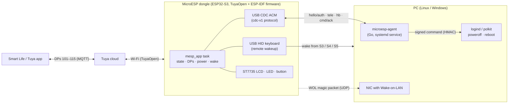

# MicroESP

MicroESP turns an **ESP32-S3** USB dongle (Pocket-Dongle-S3, a clone of the LilyGO T-Dongle-S3) into a **remote power switch for your PC**, controlled from the **Tuya / Smart Life** app:

- **Power on** the PC from the app: the dongle presents itself as a USB keyboard and wakes the PC (remote wakeup / *resume* signal), with **Wake-on-LAN** as a fallback.
- **Shut down or reboot** with a cancellable countdown (dongle button or the app). The command reaches the PC agent signed, and the agent runs it without privileges through polkit.
- **See the PC state** (on, suspended, off, no agent) and its **telemetry** (CPU, memory, free disk, uptime, hostname) in the app and on the dongle screen.

Reference PC: Lenovo ThinkStation P3 Ultra SFF G2 running Linux (Pop!_OS / Ubuntu 24.04). The agent also works on Windows 10/11 (optional).

> Status: version **0.1.0** (unreleased). See [`CHANGELOG.md`](CHANGELOG.md).

## Architecture



- The dongle and the agent share a 32-byte key, derived with HKDF from a **6-digit code** shown on the screen during pairing. Shutdown and reboot commands are signed with HMAC-SHA256 and carry session nonces and an increasing id that prevents replays.
- The agent ↔ dongle protocol is described in [`docs/protocol/cdc-v1.md`](docs/protocol/cdc-v1.md). Its normative vectors ([`protocol/testdata/vectors.json`](protocol/testdata/vectors.json)) are used by the agent and firmware tests.

## Repository layout

| Path | Contents |
|---|---|
| [`firmware/`](firmware/README.md) | Production firmware (TuyaOpen v1.9.0 app + ESP-IDF component `mesp_hal`), board `POCKET_DONGLE_S3`, host tests |
| [`panel/`](panel/README.md) | Panel MiniApp (Ray) for Smart Life connected to the TuyaLink model |
| [`agent/`](agent/README.md) | Go agent `microesp-agent`, installer, systemd units, udev/polkit rules and Windows installer |
| [`protocol/`](protocol/testdata/vectors.json) | Test vectors for the cdc-v1 protocol |
| [`docs/`](docs/) | Documentation: analysis, development setup, protocol, user guides and QA |
| `hw/` | Pinout, hardware spikes and backup of the factory firmware (ignored by git) |
| `scripts/` | Utilities: serial port access, CI dependencies |
| `.github/workflows/` | CI (agent, firmware tests, firmware build, gitleaks, shellcheck) and release |

## Quick start

1. **Development environment** (TuyaOpen, ESP-IDF and Go): [`docs/dev-setup.md`](docs/dev-setup.md).
2. **Build and flash the firmware**: [`firmware/README.md`](firmware/README.md).
   ```bash
   cd firmware && ./build.sh && sg dialout -c tools/flash.sh
   ```
3. **Full user installation** (flashing, Tuya credentials, Smart Life, agent and pairing): [`docs/user/installation.md`](docs/user/installation.md).
4. **BIOS and operating system setup so that power-on works**: [`docs/user/bios-lenovo.md`](docs/user/bios-lenovo.md).
5. **PC agent**: [`agent/README.md`](agent/README.md).
   ```bash
   sudo agent/deploy/install.sh
   sudo systemctl stop microesp-agent && sudo microesp-agent pair && sudo systemctl start microesp-agent
   ```
6. **Smart Life panel** (build in the Tuya MiniApp IDE, also on Linux under Wine, and publish): [`docs/panel-publishing.md`](docs/panel-publishing.md).
7. **End-to-end tests**: [`docs/qa/e2e-v1.md`](docs/qa/e2e-v1.md).

## Development and CI

```bash
make -C agent lint test cover     # agent: vet (linux+windows), staticcheck, gofmt, tests -race
firmware/build.sh test            # firmware: 59 Unity tests with ASan/UBSan, no ESP toolchain
```

GitHub Actions (`.github/workflows/ci.yml`) runs these jobs on every push or PR: `agent`, `firmware-host-tests`, `firmware-build` (TuyaOpen pinned to `b80932d`, with placeholder credentials), `secrets` (gitleaks, [`.gitleaks.toml`](.gitleaks.toml)) and `shell` (shellcheck). A `vX.Y.Z` tag (`release.yml`) publishes the agent for linux-amd64, linux-arm64 and windows-amd64 and the firmware (merged image and app), together with a common `SHA256SUMS`.

**Secrets**: the TuyaLink credentials (deviceSecret) and the Wi-Fi password are loaded into the dongle's NVS only through the CLI (`!tylink`, `!wifi`); the agent key (`*.key`) and the factory flash backups are never committed to the repository (see [`.gitignore`](.gitignore)).
