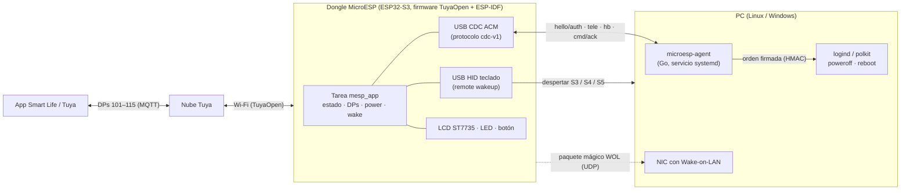

# MicroESP

MicroESP convierte un dongle USB **ESP32-S3** (Pocket-Dongle-S3, clon de LilyGO T-Dongle-S3) en un **mando remoto de encendido para el PC** controlable desde la app **Tuya / Smart Life**:

- **Encender** el PC desde la app: el dongle se presenta como teclado USB y lo despierta (remote wakeup / señal de *resume*), con **Wake-on-LAN** como respaldo.
- **Apagar o reiniciar** con cuenta atrás cancelable (botón del dongle o la app). La orden llega firmada al agente del PC, que la ejecuta sin privilegios mediante polkit.
- **Ver el estado** del PC (encendido, suspendido, apagado, sin agente) y su **telemetría** (CPU, memoria, disco libre, uptime, hostname) en la app y en la pantalla del dongle.

PC de referencia: Lenovo ThinkStation P3 Ultra SFF G2 con Linux (Pop!_OS / Ubuntu 24.04). El agente también funciona en Windows 10/11 (opcional).

> Estado: versión **0.1.0** (sin publicar). Ver [`CHANGELOG.md`](CHANGELOG.md).

## Arquitectura



- El dongle y el agente comparten una clave de 32 bytes, derivada con HKDF a partir de un **código de 6 dígitos** que muestra la pantalla al emparejar. Las órdenes de apagado o reinicio van firmadas con HMAC-SHA256, llevan nonces de sesión y un id creciente que impide repetirlas.
- El protocolo agente ↔ dongle está en [`docs/protocol/cdc-v1.md`](docs/protocol/cdc-v1.md). Sus vectores normativos ([`protocol/testdata/vectors.json`](protocol/testdata/vectors.json)) los usan los tests del agente y del firmware.

## Estructura del repositorio

| Ruta | Contenido |
|---|---|
| [`firmware/`](firmware/README.md) | Firmware de producción (app TuyaOpen v1.9.0 + componente ESP-IDF `mesp_hal`), board `POCKET_DONGLE_S3`, tests en el host |
| [`agent/`](agent/README.md) | Agente Go `microesp-agent`, instalador, unidades systemd, reglas udev/polkit e instalador de Windows |
| [`protocol/`](protocol/testdata/vectors.json) | Vectores de prueba del protocolo cdc-v1 |
| [`docs/`](docs/) | Documentación (en español): análisis, entorno de desarrollo, protocolo, guías de usuario y QA |
| `hw/` | Pinout, spikes de hardware y copia de seguridad del firmware de fábrica (ignorada por git) |
| `scripts/` | Utilidades: acceso al puerto serie, dependencias de CI |
| `.github/workflows/` | CI (agente, tests del firmware, compilación del firmware, gitleaks, shellcheck) y release |

## Puesta en marcha rápida

1. **Entorno de desarrollo** (TuyaOpen, ESP-IDF y Go): [`docs/dev-setup.md`](docs/dev-setup.md).
2. **Compilar y flashear el firmware**: [`firmware/README.md`](firmware/README.md).
   ```bash
   cd firmware && ./build.sh && sg dialout -c tools/flash.sh
   ```
3. **Instalación completa para el usuario** (flasheo, credenciales Tuya, Smart Life, agente y emparejado): [`docs/usuario/instalacion.md`](docs/usuario/instalacion.md).
4. **BIOS y sistema operativo para que funcione el encendido**: [`docs/usuario/bios-lenovo.md`](docs/usuario/bios-lenovo.md).
5. **Agente del PC**: [`agent/README.md`](agent/README.md).
   ```bash
   sudo agent/deploy/install.sh
   sudo systemctl stop microesp-agent && sudo microesp-agent pair && sudo systemctl start microesp-agent
   ```
6. **Pruebas de extremo a extremo**: [`docs/qa/e2e-v1.md`](docs/qa/e2e-v1.md).

## Desarrollo y CI

```bash
make -C agent lint test cover     # agente: vet (linux+windows), staticcheck, gofmt, tests -race
firmware/build.sh test            # firmware: 59 tests Unity con ASan/UBSan, sin toolchain de ESP
```

GitHub Actions (`.github/workflows/ci.yml`) ejecuta estos jobs en cada push o PR: `agent`, `firmware-host-tests`, `firmware-build` (TuyaOpen fijado a `b80932d`, con credenciales de relleno), `secrets` (gitleaks, [`.gitleaks.toml`](.gitleaks.toml)) y `shell` (shellcheck). Una etiqueta `vX.Y.Z` (`release.yml`) publica el agente para linux-amd64, linux-arm64 y windows-amd64 y el firmware (imagen fusionada y app), junto con un `SHA256SUMS` común.

**Secretos**: las credenciales de TuyaLink (deviceSecret) y la contraseña Wi-Fi solo se cargan en la NVS del dongle por la CLI (`!tylink`, `!wifi`); la clave del agente (`*.key`) y las copias de la flash de fábrica nunca se suben al repositorio (ver [`.gitignore`](.gitignore)).
