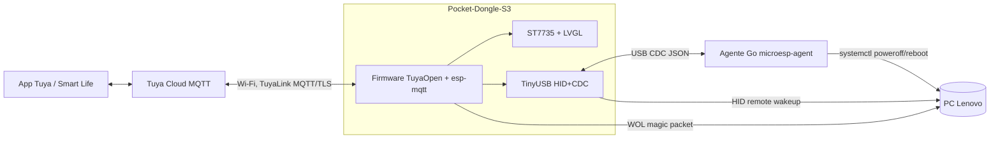

# MicroESP — Análisis y arquitectura

> Proyecto gintrack: **MESP**. Fecha: 2026-10-03.

## 1. Objetivo

Dispositivo USB basado en ESP32-S3 que, conectado al PC, aparece en la app Tuya / Smart Life como **un único dispositivo** que permite:

- **Encender** el PC (wake on keypress de Lenovo, vía teclado HID USB emulado).
- **Apagar / reiniciar** el PC (vía agente Go residente en el PC).
- Ver **estado del PC** (apagado / suspendido / encendido / encendido sin agente).
- ~~Ver voltaje VBUS~~ — **descartado del alcance (2026-10-03)**.
- Ver **telemetría** del PC: CPU %, memoria %, disco libre %.
- Mostrar todo lo anterior en la **pantalla** del dongle.

## 2. Hardware identificado

Leído con `esptool` sobre `/dev/ttyACM0` (USB 303a:1001, MAC `90:70:69:f6:62:dc`):

| Campo | Valor |
|---|---|
| Placa | "Pocket-Dongle-S3" (clon de LilyGO **T-Dongle-S3**), formato pendrive USB-A |
| SoC | ESP32-S3 (QFN56) rev v0.2, dual core 240 MHz |
| PSRAM | 8 MB embebida (S3R8, AP 3V3) |
| Flash | 16 MB quad (fabricante 0x20, id 0x4018) |
| Pantalla | 0,96" IPS **ST7735** 80×160, SPI 4 hilos |
| LED | RGB direccionable (firmware fábrica usa `neopixelWrite` → WS2812; el original LilyGO lleva APA102) |
| Otros | Ranura TF (SDMMC), botón BOOT (GPIO0), antena cerámica |
| USB | USB nativo del S3 (modo actual USB-Serial/JTAG) |
| Firmware fábrica | Demo Arduino-ESP32 2.0.13 / IDF 4.4.5. Backup en `hw/factory-backup/` (sha256 `7eb9b4211c55…`) |

Pinout de referencia T-Dongle-S3 (**a verificar en el clon**, historia de spike):

| Función | GPIO |
|---|---|
| LCD MOSI / SCLK / CS / DC / RST | 3 / 5 / 4 / 2 / 1 |
| LCD backlight (activo bajo) | 38 |
| LED (APA102 DI/CLK en original) | 40 / 39 |
| Botón | 0 |
| TF SDMMC CLK/CMD/D0/D1/D2/D3 | 12 / 16 / 14 / 17 / 21 / 18 |

**Sin medida de VBUS en placa** (requeriría mod hardware). Medición de voltaje descartada del alcance (ver §6).

## 3. Decisiones de arquitectura

### ADR-1 — El dongle es el único cliente cloud Tuya; el agente Go habla con el dongle

Tuya identifica cada dispositivo por su `deviceId` y la conexión MQTT usa un clientId derivado de él (TuyaLink: `tuyalink_<deviceId>`). **Dos clientes con las mismas credenciales se expulsan mutuamente** (verificado también con TuyaLink). Por tanto "que el binario Go se conecte como si fuera el mismo dispositivo" no es viable de forma literal.

Solución: el dongle es el único que habla con la nube (TuyaLink desde 0.2.0, ADR-5). El agente Go se conecta **al dongle por USB CDC** (el mismo cable que ya los une) y le entrega telemetría; el dongle la publica como DPs propios y reenvía al agente los comandos de apagado/reinicio. **Desde la app se ve un único dispositivo con todos los DPs**, que es el comportamiento pedido.

Alternativas descartadas:
- Dos dispositivos Tuya (segunda licencia, TuyaOpen target LINUX): funciona pero se ven dos dispositivos.
- Gateway + subdispositivo: requiere TuyaOS Gateway SDK comercial.
- Agente vía Cloud OpenAPI: el agente actuaría como "app", no como dispositivo; añade credenciales cloud en el PC.

Transporte secundario opcional: LAN (TCP/UDP local cifrado) si el dongle no está enchufado al mismo PC. Fuera del MVP.

### ADR-2 — USB compuesto HID teclado + CDC

El firmware usa el USB-OTG del S3 con TinyUSB (`esp_tinyusb`) exponiendo:
- **HID keyboard** con `bmAttributes` remote-wakeup → encendido/despertar.
- **CDC ACM** → enlace con agente Go + consola de logs.

Consecuencia: se pierde el USB-Serial/JTAG mientras corre la app. Flasheo por modo descarga ROM (BOOT pulsado al enchufar) o reset 1200-baud touch sobre CDC; OTA Tuya como vía normal.

### ADR-3 — Encendido: HID primero, WOL como respaldo

| Estado PC | Mecanismo | Fiabilidad |
|---|---|---|
| S3 (suspendido) | `tud_remote_wakeup()` con bus suspendido y wake armado por el SO | Alta (estándar USB) |
| S4/S5 (apagado) | BIOS Lenovo "wake on keypress" + "Always On USB" | **Dependiente de BIOS — validar en spike** |
| Cualquiera | Wake-on-LAN magic packet desde el dongle por Wi-Fi | Alta si NIC/BIOS tienen WOL |

El agente envía la MAC de la NIC en el `hello` para configurar WOL sin intervención. Estrategia configurable por DP (`hid`, `wol`, `hid_then_wol`).

Requisito: el puerto USB debe dar 5 V con el PC apagado (BIOS "Always On USB" / "USB power in S4/S5"); si no, el dongle se apaga con el PC y no puede encenderlo.

### ADR-4 — Estado del PC por fusión de señales

| Señal | Fuente |
|---|---|
| Alimentación presente | Dongle vivo (implícito) |
| USB montado / suspendido / desmontado | Callbacks TinyUSB `tud_mount_cb`, `tud_suspend_cb`, `tud_resume_cb`, `tud_umount_cb` |
| Heartbeat agente | Mensaje CDC cada 5 s |

Estados resultantes: `off`, `sleep`, `booting`, `on_no_agent`, `on`, `unknown`.

### ADR-5 — SDK, toolchain y protocolo de nube (revisado 2026-10-04: TuyaLink)

**Decisión vigente (0.2.0)**: la nube se habla con **TuyaLink**, el protocolo MQTT abierto de Tuya, con un cliente propio sobre `esp-mqtt` (ESP-IDF). TuyaOpen se mantiene como marco del firmware (RTOS `tal_*`, LVGL v9, compilación `tos.py`, board de 16 MB, tabla OTA dual), pero ya **no** se usa su cliente `tuya_iot`.

Por qué:
- El cliente `tuya_iot` (TuyaOS/TuyaOpen) necesita una **licencia UUID/AuthKey** por dispositivo. No se ha podido obtener: la verificación de la cuenta bloquea los pedidos de licencias. Sin licencia el firmware no llega nunca a la nube.
- TuyaLink solo necesita lo que la plataforma da al crear el dispositivo (**productId, deviceId, deviceSecret**), funciona con la cuenta actual y el dispositivo ya está vinculado a la app del usuario. Se verificó de extremo a extremo con un spike en Python (`hw/spikes/tylink_test.py`: conexión, `model/get`, `property/report` y recepción de `property/set {"power_on":true}` enviado desde la app) y después con el propio firmware.
- Mantener TuyaOpen es la opción de menor riesgo: todo el código de la app y la pantalla dependen de `tal_*` y de su LVGL, y el USB compuesto y las redes de seguridad están validados sobre él. Pasar a ESP-IDF "pelado" no aporta nada a cambio de rehacer ese trabajo. Al no enlazar `tuya_iot` desaparecen el BLE y el cliente Tuya: la imagen baja de 1,59 a 1,36 MB y el heap interno libre sube de ~65 a ~155 KB.

Protocolo (resumen; detalle en `firmware/README.md` y `firmware/schema/dp.json`):
- Broker por región: `m1.tuya{eu,us,cn,in}.com:8883`, TLS con verificación del servidor (bundle de CAs de ESP-IDF; `*.tuyaeu.com` encadena a "Go Daddy Root Certificate Authority - G2").
- `clientId = tuyalink_<deviceId>`; `username = <deviceId>|signMethod=hmacSha256,timestamp=<s>,secureMode=1,accessType=1`; `password = hex(HMAC-SHA256(deviceSecret, "deviceId=<id>,timestamp=<s>,secureMode=1,accessType=1"))`. Requiere hora real: SNTP antes de conectar. Se firma de nuevo en cada intento de conexión.
- Topics `tylink/<deviceId>/thing/...`: `property/report`, `property/set` (+ `_response`), `action/execute` (+ `_response`), `model/get` (+ `_response`). Los DPs de §5 son las propiedades del modelo de cosa: se identifican por **código**; los números 101-114 son los `abilityId` y quedan como documentación y clave interna. Los enums viajan como cadena y el bitmap como entero.
- Aprovisionamiento por la CLI del CDC (`!tylink`, `!wifi`) con la misma política release/dev que antes. Sin emparejado BLE/AP.

Consecuencias:
- **OTA por la nube**: la daba `tuya_iot`; con TuyaLink queda pendiente (topics OTA de TuyaLink). Mientras tanto, actualización por USB.
- Coste por dispositivo: sin licencia TuyaOS.
- Hay que crear cada dispositivo en la plataforma (productId/deviceId/deviceSecret) y vincularlo a la cuenta desde allí, en lugar del emparejado desde la app.

Histórico (0.1.0): firmware TuyaOpen con `tuya_iot`, pairing por **BLE** (TuyaOpen no tiene EZ), OTA vía `TUYA_EVENT_UPGRADE_NOTIFY`; licencias: 2 de desarrollo gratuitas por producto, producción 0,69 USD/dispositivo.

Agente: Go ≥1.23, `gopsutil/v4`, `go.bug.st/serial`, systemd en Linux; Windows opcional (`kardianos/service`).

## 4. Diagrama



## 5. Modelo de DPs (producto Tuya personalizado)

| DP | Código | Tipo | Modo | Rango / valores | Fuente |
|---|---|---|---|---|---|
| 101 | `pc_state` | enum | ro | off, sleep, booting, on_no_agent, on, unknown | dongle |
| 102 | `power_on` | bool | rw (pulsador) | true dispara wake | dongle |
| 103 | `power_off` | bool | rw | true → apagado con cuenta atrás | agente |
| 104 | `reboot` | bool | rw | true → reinicio con cuenta atrás | agente |
| 105 | `cpu_usage` | value | ro | 0–1000, escala 1, % | agente |
| 106 | `mem_usage` | value | ro | 0–1000, escala 1, % | agente |
| 107 | `disk_free` | value | ro | 0–1000, escala 1, % | agente |
| 108 | `agent_online` | bool | ro | | dongle |
| 109 | `wake_method` | enum | rw | hid, wol, hid_then_wol | dongle |
| 110 | `pc_uptime` | value | ro | s | agente |
| 111 | `pc_hostname` | string | ro | ≤64 | agente |
| 112 | `cmd_countdown` | value | rw | 0–60 s (seguridad apagado) | dongle |
| 113 | `last_result` | enum | ro | ok, wake_sent, wake_failed, cmd_rejected, agent_offline, cancelled | dongle |
| 114 | `fault` | bitmap | ro | agent_lost, wake_failed, hid_not_armed, cloud_lost | dongle |

Política de reporte: telemetría cada 30 s o si cambia >2 puntos; como máximo 200 reportes/DP/60 s; reporte asíncrono (deduplica). Con TuyaLink la columna "Código" es el identificador de la propiedad en el JSON y el número es el `abilityId`; los enums se envían como cadena y `fault` como entero (máscara de bits).

## 6. Medida de VBUS — descartada

Decisión 2026-10-03: fuera de alcance. La placa no mide VBUS y requeriría soldar un divisor resistivo a un GPIO ADC1. Los DPs se numeran seguidos (la plataforma Tuya exige IDs secuenciales); historias MESP-US-0004 y MESP-US-0019 canceladas.

## 7. Protocolo agente ↔ dongle (USB CDC)

- JSON por líneas (`\n`), UTF-8, ≤512 B por mensaje, campo `v` de versión.
- Agente → dongle: `hello{v,host,os,agent_ver,mac[],token}`, `tele{cpu,mem,disk_free,uptime}` cada 5–10 s, `ack{id,ok,err}`.
- Dongle → agente: `welcome{v,fw_ver,dev_id}`, `cmd{id,action:shutdown|reboot|cancel,delay}`, `ping`.
- Autenticación: token compartido (HMAC-SHA256 sobre `id|action|ts`) generado al emparejar agente; evita que cualquier proceso con acceso al puerto inyecte órdenes o que otro dispositivo CDC suplante al dongle.
- Descubrimiento: VID/PID + número de serie en `/dev/serial/by-id/`.

## 8. Seguridad

- Apagado/reinicio: cuenta atrás visible en pantalla (DP 112, por defecto 10 s), cancelable con el botón del dongle o desde la app.
- Agente Linux corre como servicio systemd con privilegios mínimos; apagado vía polkit rule o `CAP_SYS_BOOT` + `systemctl`, no root completo si es posible.
- Credenciales de nube (TuyaLink: deviceSecret) y contraseña Wi-Fi fuera del repo; inyectadas por la CLI del CDC (`!tylink`, `!wifi`) a NVS, nunca impresas ni registradas en el log.
- Puerto CDC accesible solo a grupo `dialout` / usuario del servicio.

## 9. Riesgos

| Riesgo | Impacto | Mitigación |
|---|---|---|
| BIOS Lenovo no despierta desde S5 con HID genérico | Alto | Spike temprano; fallback WOL; última opción optoacoplador al botón de power |
| Puerto USB sin alimentación en S5 | Alto | Activar "Always On USB"; documentar puerto correcto |
| TuyaOpen ESP32 no permite TinyUSB/USB-OTG fácilmente | Alto | Spike de integración; alternativa: ESP-IDF propio + componente TuyaOpen |
| Pinout del clon distinto al LilyGO | Medio | Spike de pin-probe con test LCD/LED |
| Arduino-esp32 #10831: S3 detecta disconnect en vez de suspend | Medio | Usar ESP-IDF + esp_tinyusb; referencia `nonoo/esp-remote-wakeup` |
| Licencias TuyaOS (UUID/AuthKey) imposibles de obtener (bloqueo de verificación de cuenta) | Alto (materializado) | TuyaLink con productId/deviceId/deviceSecret (ADR-5) |
| OTA por la nube sin implementar con TuyaLink | Medio | Actualización por USB; implementar los topics OTA de TuyaLink |

## 10. Estructura de repositorio propuesta

```
firmware/        # TuyaOpen app (tos.py), board config pocket-dongle-s3
  src/{app_main,tuya_dp,usb_composite,wake,display,agent_link,state}.c
agent/           # Go module microesp-agent
  cmd/microesp-agent/  internal/{link,telemetry,power,config}/
  deploy/{systemd,install.sh,polkit,windows}/
hw/              # backup fábrica, pinout
docs/            # análisis, ADRs, backlog gintrack (.pmngr)
scripts/         # utilidades (setup-serial-access.sh)
```

## 11. Fuentes

- TuyaOpen: https://github.com/tuya/TuyaOpen — licencias: https://tuyaopen.ai/pricing, https://tuyaopen.ai/docs/faqs/get-developer-license
- TuyaLink: documentación "TuyaLink" en https://developer.tuya.com (protocolo MQTT, autenticación y topics); parámetros verificados con `hw/spikes/tylink_test.py`.
- DPs Tuya: https://developer.tuya.com/en/docs/iot/define-product-features?id=K97vug7wgxpoq
- Remote wakeup S3: https://github.com/nonoo/esp-remote-wakeup, https://github.com/espressif/arduino-esp32/issues/10831
- T-Dongle-S3: https://wiki.lilygo.cc/products/t-dongle-series/t-dongle-s3/
