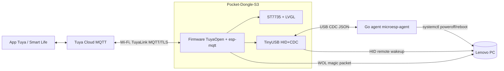

# MicroESP — Analysis and architecture

> gintrack project: **MESP**. Date: 2026-10-03.

## 1. Goal

ESP32-S3-based USB device that, when connected to the PC, shows up in the Tuya / Smart Life app as **a single device** that allows:

- **Powering on** the PC (Lenovo wake on keypress, via an emulated USB HID keyboard).
- **Powering off / rebooting** the PC (via a resident Go agent on the PC).
- Seeing the **PC state** (off / suspended / on / on without agent).
- ~~See VBUS voltage~~ — **dropped from scope (2026-10-03)**.
- Seeing PC **telemetry**: CPU %, memory %, free disk %.
- Showing all of the above on the dongle's **display**.

## 2. Identified hardware

Read with `esptool` on `/dev/ttyACM0` (USB 303a:1001, MAC `90:70:69:f6:62:dc`):

| Field | Value |
|---|---|
| Board | "Pocket-Dongle-S3" (clone of LilyGO **T-Dongle-S3**), USB-A pendrive form factor |
| SoC | ESP32-S3 (QFN56) rev v0.2, dual core 240 MHz |
| PSRAM | 8 MB embedded (S3R8, AP 3V3) |
| Flash | 16 MB quad (manufacturer 0x20, id 0x4018) |
| Display | 0.96" IPS **ST7735** 80×160, 4-wire SPI |
| LED | Addressable RGB (factory firmware uses `neopixelWrite` → WS2812; the original LilyGO has APA102) |
| Other | TF slot (SDMMC), BOOT button (GPIO0), ceramic antenna |
| USB | Native S3 USB (current mode USB-Serial/JTAG) |
| Factory firmware | Arduino-ESP32 2.0.13 / IDF 4.4.5 demo. Backup in `hw/factory-backup/` (sha256 `7eb9b4211c55…`) |

Reference T-Dongle-S3 pinout (**to be verified on the clone**, spike story):

| Function | GPIO |
|---|---|
| LCD MOSI / SCLK / CS / DC / RST | 3 / 5 / 4 / 2 / 1 |
| LCD backlight (active low) | 38 |
| LED (APA102 DI/CLK on the original) | 40 / 39 |
| Button | 0 |
| TF SDMMC CLK/CMD/D0/D1/D2/D3 | 12 / 16 / 14 / 17 / 21 / 18 |

**No VBUS measurement on the board** (it would require a hardware mod). Voltage measurement dropped from scope (see §6).

## 3. Architecture decisions

### ADR-1 — The dongle is the only Tuya cloud client; the Go agent talks to the dongle

Tuya identifies each device by its `deviceId` and the MQTT connection uses a clientId derived from it (TuyaLink: `tuyalink_<deviceId>`). **Two clients with the same credentials kick each other out** (also verified with TuyaLink). So "having the Go binary connect as if it were the same device" is not literally viable.

Solution: the dongle is the only one that talks to the cloud (TuyaLink since 0.2.0, ADR-5). The Go agent connects **to the dongle over USB CDC** (the same cable that already joins them) and hands it telemetry; the dongle publishes it as its own DPs and forwards the shutdown/reboot commands to the agent. **From the app a single device with all the DPs is seen**, which is the requested behavior.

Discarded alternatives:
- Two Tuya devices (second license, TuyaOpen target LINUX): works but two devices are seen.
- Gateway + sub-device: requires the commercial TuyaOS Gateway SDK.
- Agent via Cloud OpenAPI: the agent would act as an "app", not as a device; it adds cloud credentials on the PC.

Optional secondary transport: LAN (encrypted local TCP/UDP) if the dongle is not plugged into the same PC. Out of the MVP.

### ADR-2 — Composite USB: HID keyboard + CDC

The firmware uses the S3's USB-OTG with TinyUSB (`esp_tinyusb`), exposing:
- **HID keyboard** with `bmAttributes` remote-wakeup → power-on/wake.
- **CDC ACM** → link with the Go agent + log console.

Consequence: USB-Serial/JTAG is lost while the app runs. Flashing is done via ROM download mode (BOOT held while plugging in) or a 1200-baud touch reset over CDC; Tuya OTA as the normal path.

### ADR-3 — Power-on: HID first, WOL as fallback

| PC state | Mechanism | Reliability |
|---|---|---|
| S3 (suspended) | `tud_remote_wakeup()` with the bus suspended and wake armed by the OS | High (USB standard) |
| S4/S5 (off) | Lenovo BIOS "wake on keypress" + "Always On USB" | **BIOS-dependent — validate in spike** |
| Any | Wake-on-LAN magic packet from the dongle over Wi-Fi | High if NIC/BIOS have WOL |

The agent sends the NIC's MAC in the `hello` to configure WOL without intervention. Strategy configurable via DP (`hid`, `wol`, `hid_then_wol`).

Requirement: the USB port must supply 5 V with the PC off (BIOS "Always On USB" / "USB power in S4/S5"); otherwise the dongle powers off with the PC and cannot turn it on.

### ADR-4 — PC state by signal fusion

| Signal | Source |
|---|---|
| Power present | Dongle alive (implicit) |
| USB mounted / suspended / unmounted | TinyUSB callbacks `tud_mount_cb`, `tud_suspend_cb`, `tud_resume_cb`, `tud_umount_cb` |
| Agent heartbeat | CDC message every 5 s |

Resulting states: `off`, `sleep`, `booting`, `on_no_agent`, `on`, `unknown`.

### ADR-5 — SDK, toolchain and cloud protocol (revised 2026-10-04: TuyaLink)

**Current decision (0.2.0)**: the cloud is spoken with **TuyaLink**, Tuya's open MQTT protocol, with a custom client on top of `esp-mqtt` (ESP-IDF). TuyaOpen is kept as the firmware framework (`tal_*` RTOS, LVGL v9, `tos.py` build, 16 MB board, dual OTA table), but its `tuya_iot` client is **no longer** used.

Why:
- The `tuya_iot` client (TuyaOS/TuyaOpen) needs a **UUID/AuthKey license** per device. It could not be obtained: account verification blocks license orders. Without a license the firmware never reaches the cloud.
- TuyaLink only needs what the platform gives when the device is created (**productId, deviceId, deviceSecret**), works with the current account and the device is already linked to the user's app. It was verified end to end with a Python spike (`hw/spikes/tylink_test.py`: connection, `model/get`, `property/report` and reception of `property/set {"power_on":true}` sent from the app) and then with the firmware itself.
- Keeping TuyaOpen is the lowest-risk option: all the app and display code depends on `tal_*` and its LVGL, and the composite USB and the safety nets are validated on it. Moving to "bare" ESP-IDF gains nothing in exchange for redoing that work. Since `tuya_iot` is no longer linked, BLE and the Tuya client are gone: the image drops from 1.59 to 1.36 MB and free internal heap rises from ~65 to ~155 KB.

Protocol (summary; details in `firmware/README.md` and `firmware/schema/dp.json`):
- Broker per region: `m1.tuya{eu,us,cn,in}.com:8883`, TLS with server verification (ESP-IDF CA bundle; `*.tuyaeu.com` chains to "Go Daddy Root Certificate Authority - G2").
- `clientId = tuyalink_<deviceId>`; `username = <deviceId>|signMethod=hmacSha256,timestamp=<s>,secureMode=1,accessType=1`; `password = hex(HMAC-SHA256(deviceSecret, "deviceId=<id>,timestamp=<s>,secureMode=1,accessType=1"))`. Requires real time: SNTP before connecting. It is signed again on every connection attempt.
- Topics `tylink/<deviceId>/thing/...`: `property/report`, `property/set` (+ `_response`), `action/execute` (+ `_response`), `model/get` (+ `_response`). The DPs in §5 are the properties of the thing model: they are identified by **code**; the numbers 101-116 are the `abilityId`s and remain as documentation and internal key. Enums travel as strings and the bitmap as an integer.
- Provisioning through the CDC CLI (`!tylink`, `!wifi`) with the same release/dev policy as before. No BLE/AP pairing.

Consequences:
- **Cloud OTA**: `tuya_iot` provided it; with TuyaLink it is pending (TuyaLink OTA topics). In the meantime, update over USB.
- Cost per device: no TuyaOS license.
- Each device has to be created on the platform (productId/deviceId/deviceSecret) and linked to the account from there, instead of pairing from the app.

History (0.1.0): TuyaOpen firmware with `tuya_iot`, pairing over **BLE** (TuyaOpen has no EZ), OTA via `TUYA_EVENT_UPGRADE_NOTIFY`; licenses: 2 free development licenses per product, production 0.69 USD/device.

Agent: Go ≥1.23, `gopsutil/v4`, `go.bug.st/serial`, systemd on Linux; Windows optional (`kardianos/service`).

## 4. Diagram



## 5. DP model (custom Tuya product)

| DP | Code | Type | Mode | Range / values | Source |
|---|---|---|---|---|---|
| 101 | `pc_state` | enum | ro | off, sleep, booting, on_no_agent, on, unknown | dongle |
| 102 | `power_on` | bool | rw (push button) | true triggers wake | dongle |
| 103 | `power_off` | bool | rw | true → shutdown with countdown | agent |
| 104 | `reboot` | bool | rw | true → reboot with countdown | agent |
| 105 | `cpu_usage` | value | ro | 0–1000, scale 1, % | agent |
| 106 | `mem_usage` | value | ro | 0–1000, scale 1, % | agent |
| 107 | `disk_free` | value | ro | 0–1000, scale 1, % | agent |
| 108 | `agent_online` | bool | ro | | dongle |
| 109 | `wake_method` | enum | rw | hid, wol, hid_then_wol | dongle |
| 110 | `pc_uptime` | value | ro | s | agent |
| 111 | `pc_hostname` | string | ro | ≤64 | agent |
| 112 | `cmd_countdown` | value | rw | 0–60 s (shutdown safety) | dongle |
| 113 | `last_result` | enum | ro | ok, wake_sent, wake_failed, cmd_rejected, agent_offline, cancelled | dongle |
| 114 | `fault` | bitmap | ro | agent_lost, wake_failed, hid_not_armed, cloud_lost | dongle |
| 115 | `scripts` | string | ro | ≤255; compact JSON `[["<id>","<label>"],...]` of the agent's user scripts (0..5, ≤221 bytes); not reported until the agent sends its list | agent |
| 116 | `script_run` | string | rw (push button) | ≤12; `<id>` of a script in 115 → `cmd script:<id>`; result in 113; reported back to `""` | dongle |

Reporting policy: telemetry every 30 s or if it changes by >2 points; at most 200 reports/DP/60 s; asynchronous reporting (deduplicates). With TuyaLink the "Code" column is the property identifier in the JSON and the number is the `abilityId`; enums are sent as strings and `fault` as an integer (bit mask).

## 6. VBUS measurement — dropped

Decision 2026-10-03: out of scope. The board does not measure VBUS and it would require soldering a resistive divider to an ADC1 GPIO. The DPs are numbered consecutively (the Tuya platform requires sequential IDs); stories MESP-US-0004 and MESP-US-0019 cancelled.

## 7. Agent ↔ dongle protocol (USB CDC)

- Line-delimited JSON (`\n`), UTF-8, ≤512 B per message, version field `v`.
- Agent → dongle: `hello{v,host,os,agent_ver,mac[],token}`, `tele{cpu,mem,disk_free,uptime}` every 5–10 s, `ack{id,ok,err}`.
- Dongle → agent: `welcome{v,fw_ver,dev_id}`, `cmd{id,action:shutdown|reboot|cancel,delay}`, `ping`.
- Authentication: shared token (HMAC-SHA256 over `id|action|ts`) generated when pairing the agent; it prevents any process with access to the port from injecting commands, or another CDC device from impersonating the dongle.
- Discovery: VID/PID + serial number in `/dev/serial/by-id/`.

## 8. Security

- Shutdown/reboot: countdown visible on the display (DP 112, default 10 s), cancelable with the dongle button or from the app.
- Linux agent runs as a systemd service with minimal privileges; shutdown via a polkit rule or `CAP_SYS_BOOT` + `systemctl`, not full root if possible.
- Cloud credentials (TuyaLink: deviceSecret) and the Wi-Fi password stay out of the repo; injected through the CDC CLI (`!tylink`, `!wifi`) into NVS, never printed or logged.
- CDC port accessible only to the `dialout` group / the service user.

## 9. Risks

| Risk | Impact | Mitigation |
|---|---|---|
| Lenovo BIOS does not wake from S5 with a generic HID | High | Early spike; WOL fallback; last resort optocoupler on the power button |
| USB port without power in S5 | High | Enable "Always On USB"; document the right port |
| TuyaOpen ESP32 does not easily allow TinyUSB/USB-OTG | High | Integration spike; alternative: own ESP-IDF + TuyaOpen component |
| Clone pinout differs from the LilyGO | Medium | Pin-probe spike with LCD/LED test |
| Arduino-esp32 #10831: S3 detects disconnect instead of suspend | Medium | Use ESP-IDF + esp_tinyusb; reference `nonoo/esp-remote-wakeup` |
| TuyaOS licenses (UUID/AuthKey) impossible to obtain (account verification block) | High (materialized) | TuyaLink with productId/deviceId/deviceSecret (ADR-5) |
| Cloud OTA not implemented with TuyaLink | Medium | Update over USB; implement the TuyaLink OTA topics |

## 10. Proposed repository structure

```
firmware/        # TuyaOpen app (tos.py), board config pocket-dongle-s3
  src/{app_main,tuya_dp,usb_composite,wake,display,agent_link,state}.c
agent/           # Go module microesp-agent
  cmd/microesp-agent/  internal/{link,telemetry,power,config}/
  deploy/{systemd,install.sh,polkit,windows}/
hw/              # factory backup, pinout
docs/            # analysis, ADRs, gintrack backlog (.pmngr)
scripts/         # utilities (setup-serial-access.sh)
```

## 11. Sources

- TuyaOpen: https://github.com/tuya/TuyaOpen — licenses: https://tuyaopen.ai/pricing, https://tuyaopen.ai/docs/faqs/get-developer-license
- TuyaLink: "TuyaLink" documentation at https://developer.tuya.com (MQTT protocol, authentication and topics); parameters verified with `hw/spikes/tylink_test.py`.
- Tuya DPs: https://developer.tuya.com/en/docs/iot/define-product-features?id=K97vug7wgxpoq
- Remote wakeup S3: https://github.com/nonoo/esp-remote-wakeup, https://github.com/espressif/arduino-esp32/issues/10831
- T-Dongle-S3: https://wiki.lilygo.cc/products/t-dongle-series/t-dongle-s3/
